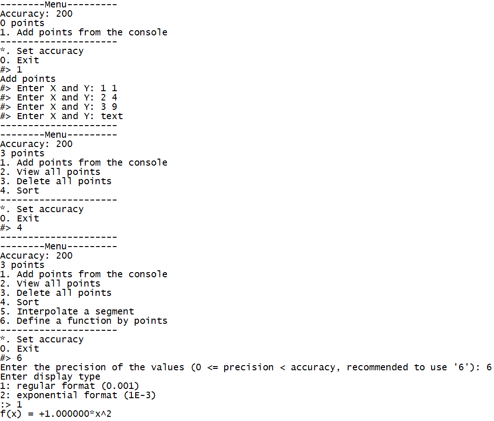

# Sorting-and-Interpolation
Shell sorting and input data interpolation by the Lagrange method

It requires a Matplotlib (with 'pyplot').

Program features:
1. Add points from the console.
2. View all points.
3. Delete all points.
4. Sort.
5. Interpolate a segment.
6. Define a table function formula (e.g. for input [1 1], [2 4], [3 9] and [4 16] the function is 1*x^2).

